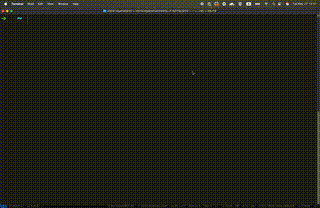

# Terminal Bookmarks

terminal bookmarks  - the last bookmarking app you'll need. 



## Installation

```sh
brew tap victorelgersma/terminal-bookmarks
brew install bm
```

## Requirements
- Bash (or zsh)
- grep (standard on Unix-like systems)


## Interface

We expose  the commands bm add and get

the syntax of bm add is somewhat similar to git 

```sh
$ bm add 
Usage: bm add <url> -c <description>
```

```sh
$ bm add "https://www.theguardian.com/education/2025/may/24/children-with-special-needs-in-england-may-lose-legal-right-to-school-support" -c "guardian article which I need for x y z project"
✅ saved "https://www.theguardian.com/education/2025/may/24/children-with-special-needs-in-england-may-lose-legal-right-to-school-support" to data/bookmarks.txt
```

if passed without a c flag it will prompt you for a description

```sh 
$ bm add "your  url" 
$ enter descritption
my description here
```


## Editing bookmarks

To manually edit your bookmarks, open the store file in your editor:

```sh
vim "${BM_STORE:-$HOME/.bm_bookmarks.txt}"
```

## Customizing the Data Store Location

By default, `bm` stores your bookmarks in `~/.bm_bookmarks.txt`.  
If you want to use a different file or location, you can override this by setting the `BM_STORE` environment variable:

```sh
export BM_STORE=~/my_custom_bookmarks.txt
```

After setting this variable, all `bm` commands will read from and write to your chosen file.  
This is useful if you want to sync your bookmarks file with cloud storage, use a project-specific store, or keep multiple sets of bookmarks.

## Future work

## Issues

Now that it's a package rather than a repo, it's much harder to edit my bookmarks store. I can think of a few solutions

1. find the place where bookmarks are kept and just use that - issue with this is that it might not be consistent between homebrew installs - but surely that's a YAGNI
2. elaborate data portability work (see above) - maybe that's too complicated though

- currently when I create a new release I need to manually adjust the homebrew-terminal-bookmarks repo to publish.

## Local Development

To work on `bm` locally (without Homebrew):

1. **Clone the repository:**
   ```sh
   git clone https://github.com/victorelgersma/terminal-bookmarks.git
   cd terminal-bookmarks
   ```

2. **Make the script executable:**
   ```sh
   chmod +x bm.sh
   ```

3. **Run the script directly:**
   ```sh
   ./bm.sh add "https://example.com" -c "example description"
   ./bm.sh get "example"
   ```

4. *(Optional)*: Add an alias for convenience:
   ```sh
   alias bm="$PWD/bm.sh"
   ```

5. *(Optional)*: Run tests or contribute changes as needed.

**Note:**  
By default, bookmarks will be stored at `~/.bm_bookmarks.txt` unless you set the `BM_STORE` environment variable.
